# 👣 Lifecycles and infrastructure


These schemas are a bit old and hard to understand, but they can help you to understand how Remède is working.


## Application working schema

This schema shows how the mobile application (with the dictionary downloaded) is retrieving the data.

## Infrastructure schema

This schema shows which extern services are used through their API by the mobile application.

## Application requests schema

Schemas showing how and when Remède make requests.

### When database is not downloaded

```mermaid
sequenceDiagram
    title Interaction schema with only online Client (database not downloaded)
    box Client
    participant Frontend
    end
    box Server
    participant API
    participant Memory
    participant Filesystem
    end
    API->>Filesystem: Collecting JSON files
    Filesystem-->>API: 
    API-->>Memory: 
    API->>Filesystem: Generating sheets objects
    Filesystem-->>API: 
    API-->>Memory: 
    Note over Frontend,API: Fetching a word
    Frontend->>+API: Can I get word `remède` ?
    API-->>Memory: 
    Memory-->>API: 
    API-->>-Frontend: {[...]}


    Note over Frontend,API: Fetching a sheet
    Frontend->>+API: Can I get sheets ?
    API->>Memory: Get sheet
    Memory-->>API: 
    API->>-Frontend: {[...]}
```

### When database is downloaded

```mermaid
sequenceDiagram
    title Interaction schema with database downloaded on the client filesystem
    box Client
    participant Files as Filesystem
    participant Frontend
    participant Database
    end
    box Server
    participant API
    participant Memory
    participant Filesystem
    end
    Frontend->>Files: Read database
    Files-->>Database: 
    API->>Filesystem: Collecting JSON files
    Filesystem-->>API: 
    API-->>Memory: 
    API->>Filesystem: Generating sheets objects
    Filesystem-->>API: 
    API-->>Memory: 
    Note over Frontend,Database: Fetching a word
    Frontend->>Database: Can I get word `remède` ?
    Database-->>Frontend: 


    Note over Frontend,API: Fetching a sheet
    Frontend->>+API: Can I get sheets ?
    API->>Memory: Get sheet
    Memory-->>API: 
    API->>-Frontend: {[...]}

```

_Here, we can see that sheets can only be fetched with an internet connection. The same goes for the word of the day_
