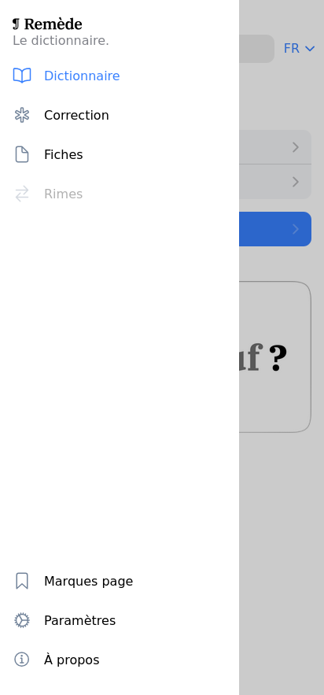

# 📖 Offline dictionaries

## Download dictionaries



### Go to the settings page

Go to the settings page using the menu.

<figure><figcaption>
Screenshot of the application menu.
</figcaption></figure>




### Select the dictionary to download

Select your dictionary version to download in the dropdown menu

<figure><figcaption>
Screenshot of the settings page
</figcaption></figure> <figure><figcaption>
Screenshot of the dictionary selection
</figcaption></figure>




### Click on download

Press the download button and wait. Keep the application opened. When download is finished, you will see a popup message and the application will restart automatically.

<figure><figcaption>
Screenshot of the download button
</figcaption></figure> <figure><figcaption>
Dictionary downloading...
</figcaption></figure> <figure><figcaption>
Download finished message.
</figcaption></figure>




### You're done !

Enjoy browsing Remède offline !



## Download multiple dictionaries

You can download multiple dictionaries. Just repeat the [#download-dictionaries](offline-dictionaries.md#download-dictionaries "mention") instructions with the dictionary you want to add. When you're done, you can set a favourite dictionary using the heart icon. The favourite dictionary will be used by default.

## Update dictionaries



### Go to the settings page

Go to the settings page using the menu.

<figure><figcaption></figcaption></figure>




### Press the update button

If a dictionary can be update, you will see a "Update" button. Just press and wait for the end of the download. Keep the application opened. When download is finished, you will see a popup message and the application will restart automatically.

<figure><figcaption></figcaption></figure>




### Dictionary updated !

Enjoy your updated dictionary offline !



